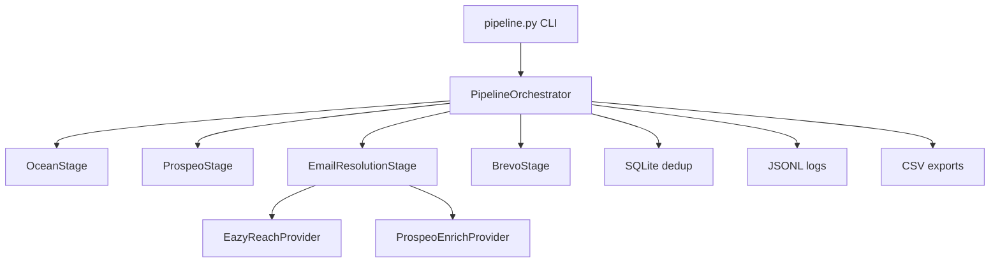

# Outreach Engine

A production-grade Python CLI that automates the full cold-outreach pipeline for the Vocallabs/Subspace SDE assignment.

**One input. Four stages. Zero manual handoffs.**

```bash
python pipeline.py validate
python pipeline.py dry-run stripe.com
python pipeline.py run stripe.com --confirm-send
```

---

## Problem Statement

Sales teams spend hours manually finding lookalike companies, hunting decision-makers on LinkedIn, verifying emails, and sending outreach. This tool automates the entire chain:

1. **Ocean.io** — seed domain → lookalike company domains
2. **Prospeo** — domains → C-Suite / Founder / VP contacts + LinkedIn URLs
3. **EazyReach** — LinkedIn URLs → verified work emails
4. **Brevo** — emails → personalized outreach sent automatically

---

## Architecture



Every stage implements `PipelineStage.run(input) -> output`. The orchestrator only connects stages — adding a fifth stage means creating a new class and registering it in the orchestrator list.

---

## Data Flow

| Stage | Input | Output | API |
|-------|-------|--------|-----|
| 1 | `stripe.com` | 20 lookalike domains | `POST /v3/search/companies` |
| 2 | company domains | decision-makers + LinkedIn | `POST /search-person` |
| 3 | LinkedIn URLs | verified work emails | EazyReach or Prospeo `/enrich-person` |
| 4 | emails + template vars | sent outreach emails | `POST /v3/smtp/email` |

---

## Setup

### Prerequisites

- Python 3.11+
- Accounts: [Ocean.io](https://ocean.io), [Prospeo](https://app.prospeo.io/api), [EazyReach](https://eazyreach.app), [Brevo](https://app.brevo.com)
- A verified sender domain in Brevo (assignment recommends getting a domain first)

### Install

```bash
cd outreach-engine
python -m venv .venv

# Windows
.venv\Scripts\activate

# macOS/Linux
source .venv/bin/activate

pip install -r requirements.txt
cp .env.example .env
# Edit .env with your API keys
```

### EazyReach Credits

Per the assignment: create an EazyReach account, then message Vocallabs on WhatsApp **+91 99400 91513** to have credits topped up. Generate your API key at [docs.eazyreach.app/api-keys](https://docs.eazyreach.app/api-keys).

Until EazyReach is configured, the pipeline automatically uses **Prospeo enrich-person** as a fallback for Stage 3.

---

## Environment Variables

| Variable | Required | Description |
|----------|----------|-------------|
| `OCEAN_IO_API_KEY` | Yes | Ocean.io API token |
| `PROSPEO_API_KEY` | Yes | Prospeo API key |
| `EAZYREACH_API_KEY` | No | EazyReach API key (falls back to Prospeo) |
| `EAZYREACH_BASE_URL` | No | EazyReach API base URL |
| `BREVO_API_KEY` | For sending | Brevo **REST** API key (not SMTP key) |
| `SENDER_EMAIL` | For sending | Verified sender in Brevo |
| `SENDER_NAME` | For sending | Display name for outreach |
| `MAX_COMPANIES` | No | Lookalike companies to fetch (default: 20) |
| `MAX_CONTACTS_PER_COMPANY` | No | Decision-makers per company (default: 3) |
| `RETRY_MAX_ATTEMPTS` | No | API retry limit (default: 5) |

---

## API Integration Strategy

### Ocean.io
- Warmup seed domain (free) before lookalike search
- `POST /v3/search/companies` with `lookalikeDomains` filter
- Paginate via `searchAfter` cursor

### Prospeo
- `POST /search-person` with seniority filter: C-Suite, Founder/Owner, VP
- Batch up to 500 domains per request
- Paginate through results

### EazyReach (primary) / Prospeo enrich (fallback)
- EazyReach: LinkedIn URL → work email via REST API
- Fallback: `POST /enrich-person` with `only_verified_email: true`
- Provider selection is automatic based on `EAZYREACH_API_KEY`

### Brevo
- `POST /v3/smtp/email` with Jinja2-rendered HTML body
- 3 rotating subject line variants
- Safety gate: no sends without `--confirm-send`

---

## Error Handling Strategy

- **Per-item isolation**: one company/contact failure does not crash the pipeline
- **Retry with backoff**: automatic retry on 429, 500, 502, 503, 504
- **Header-driven delays**: reads `Retry-After`, `x-minute-reset-seconds`, `x-sib-ratelimit-reset`
- **Graceful degradation**: unresolved emails are skipped; run completes with summary

---

## Rate Limit Strategy

- `RateLimiter` reads remaining quota from response headers
- Throttles proactively when quota is nearly exhausted
- Never uses hardcoded sleep values — all delays derived from API headers or exponential backoff

---

## Standout Features

| # | Feature | Implementation |
|---|---------|----------------|
| 1 | Rich CLI dashboard | Progress bars + live stats table |
| 2 | Safety checkpoint | Preview + `--confirm-send` gate |
| 3 | Dry-run mode | Full pipeline, no email sends |
| 4 | SQLite dedup | Domains, contacts, emails, sent records |
| 5 | Auto-retry | Exponential backoff on transient errors |
| 6 | Observability | JSONL request/response logs |
| 7 | CSV export | companies, contacts, emails, sent_emails |
| 8 | Personalization | Jinja2 template + 3 subject variants |
| 9 | Rate limit awareness | Header-driven throttling |
| 10 | Failure tolerance | Per-item try/except, continue on error |

---

## Demo Instructions

```bash
# 1. Validate all integrations
python pipeline.py validate

# 2. Dry run (no emails sent)
python pipeline.py dry-run stripe.com

# 3. Full run with safety checkpoint (no sends)
python pipeline.py run stripe.com

# 4. Actually send emails
python pipeline.py run stripe.com --confirm-send
```

Check outputs:
- `outputs/companies.csv`, `contacts.csv`, `emails.csv`, `sent_emails.csv`
- `logs/requests-YYYYMMDD.jsonl`

---

## Interview Discussion Points

1. **Modularity** — `PipelineStage` ABC; each stage is one file, one responsibility
2. **Extensibility** — "Add a fifth stage" = new class + one line in orchestrator
3. **Dedup** — SQLite prevents duplicate domains, contacts, emails across runs
4. **Safety** — explicit `--confirm-send`; dry-run for exploration
5. **Resilience** — retry, rate limits, per-item failure isolation
6. **Observability** — every API call logged to JSONL with timing and status
7. **Provider pattern** — EazyReach vs Prospeo fallback without changing orchestrator

---

## Future Improvements

- Async pipeline with `asyncio` + `httpx.AsyncClient` for parallel enrichment
- Webhook-based async providers (Ocean.io reveal, EazyReach)
- CRM export (HubSpot, Salesforce)
- A/B subject line tracking with open-rate feedback
- Web dashboard for run history and analytics
- Configurable email templates per industry vertical

---

## Project Structure

```
outreach-engine/
├── pipeline.py              # CLI entry point + orchestrator
├── stages/
│   ├── base.py              # PipelineStage exports
│   ├── ocean.py             # Stage 1
│   ├── prospeo.py           # Stage 2
│   ├── eazyreach.py         # Stage 3 (provider adapter)
│   └── brevo.py             # Stage 4
├── models/schemas.py        # Pydantic models + PipelineStage ABC
├── storage/database.py      # SQLite persistence + dedup
├── utils/
│   ├── config.py            # Settings from .env
│   ├── retry.py             # Backoff + rate limiting
│   ├── logger.py            # JSONL observability
│   └── export.py            # CSV export
├── templates/outreach.j2    # Email template
├── outputs/                 # CSV exports
└── logs/                    # JSONL request logs
```

---

## License

Built for the Vocallabs/Subspace SDE take-home assignment.
