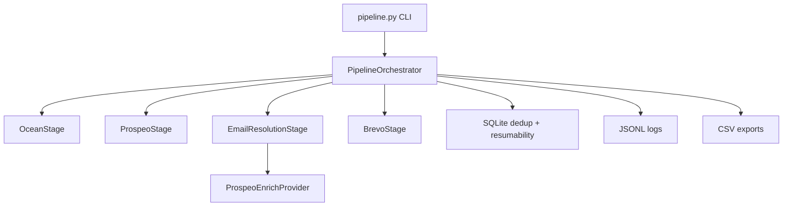

# Outreach Engine

A production-grade Python CLI that automates the full cold-outreach pipeline for the Vocallabs/Subspace SDE assignment.

**One input. Four stages. Zero manual handoffs.**

```bash
python pipeline.py validate
python pipeline.py dry-run stripe.com
python pipeline.py run stripe.com --confirm-send
python pipeline.py report --run-id 1
```

Built by **Rohit Kumar Rai** — [rohit@divfixer.com](mailto:rohit@divfixer.com) | [DivFixer](https://divfixer.com) | [GitHub](https://github.com/rohitkumarrai7)

---

## Problem Statement

Sales teams spend hours manually finding lookalike companies, hunting decision-makers on LinkedIn, verifying emails, and sending outreach. This tool automates the entire chain:

1. **Ocean.io** — seed domain → lookalike company domains
2. **Prospeo** — domains → C-Suite / Founder / VP contacts + LinkedIn URLs
3. **Prospeo enrich** — LinkedIn URLs → verified work emails
4. **Brevo** — emails → personalized outreach sent automatically

> **Assignment update (June 7):** EazyReach has been officially removed. Stage 3 uses Prospeo's `enrich-person` endpoint exclusively.

---

## Architecture



Every stage implements `PipelineStage.run(input) -> output`. The orchestrator only connects stages — adding a fifth stage means creating a new class and registering it in the orchestrator list.

---

## Data Flow

| Stage | Input | Output | API |
|-------|-------|--------|-----|
| 1 | `stripe.com` | lookalike domains | `POST /v3/search/companies` |
| 2 | company domains | decision-makers + LinkedIn | `POST /search-person` (X-KEY) |
| 3 | LinkedIn URLs | verified work emails | `POST /enrich-person` (X-API-KEY) |
| 4 | emails + template vars | sent outreach emails | `POST /v3/smtp/email` |

---

## Setup

### Prerequisites

- Python 3.11+
- Accounts: [Ocean.io](https://ocean.io), [Prospeo](https://app.prospeo.io/api), [Brevo](https://app.brevo.com)
- A verified sender domain in Brevo

### Install

```bash
cd outreach-engine
python -m venv .venv

# Windows
.venv\Scripts\activate

# macOS/Linux
source .venv/bin/activate

pip install -r requirements.txt
cp .env.example .env
# Edit .env with your API keys
```

---

## Environment Variables

| Variable | Required | Description |
|----------|----------|-------------|
| `OCEAN_IO_API_KEY` | Yes | Ocean.io API token |
| `PROSPEO_API_KEY` | Yes | Prospeo API key (X-KEY for search, X-API-KEY for enrich) |
| `BREVO_API_KEY` | For sending | Brevo REST API key (SMTP keys tested for compatibility) |
| `SENDER_EMAIL` | For sending | Verified sender in Brevo |
| `SENDER_NAME` | For sending | Display name for outreach |
| `MAX_COMPANIES` | No | Lookalike companies to fetch (default: 20) |
| `MAX_CONTACTS_PER_COMPANY` | No | Decision-makers per company (default: 3) |
| `RETRY_MAX_ATTEMPTS` | No | API retry limit (default: 5) |

---

## API Integration Strategy

### Ocean.io
- Optional warmup via `POST /v2/warmup/companies` (skipped gracefully if unavailable)
- `POST /v3/search/companies` with `lookalikeDomains` filter
- Paginate via `searchAfter` cursor

### Prospeo
- **Stage 2:** `POST /search-person` with header `X-KEY`, seniority filter C-Suite/Founder/VP
- **Stage 3:** `POST /enrich-person` with header `X-API-KEY`, `only_verified_email: true`
- Batch up to 500 domains per search request

### Brevo
- `POST /v3/smtp/email` with Jinja2-rendered HTML body
- 3 rotating subject line variants (hash-based deterministic A/B assignment)
- Safety gate: no sends without `--confirm-send`

---

## Error Handling Strategy

- **Per-item isolation**: one company/contact failure does not crash the pipeline
- **Retry with backoff**: automatic retry on 429, 500, 502, 503, 504
- **Header-driven delays**: reads `Retry-After`, `x-minute-reset-seconds`, `x-sib-ratelimit-reset`
- **Graceful degradation**: unresolved emails are skipped; run completes with summary
- **Resumability**: each stage checks SQLite before calling APIs — crash-safe reruns

---

## Rate Limit Strategy

- `RateLimiter` reads remaining quota from response headers
- Throttles proactively when quota is nearly exhausted
- Never uses hardcoded sleep values — all delays derived from API headers or exponential backoff

---

## Standout Features

| # | Feature | Implementation |
|---|---------|----------------|
| 1 | Rich CLI dashboard | Progress bars + live stats table |
| 2 | Safety checkpoint | Preview + `--confirm-send` gate |
| 3 | Dry-run mode | Full pipeline, no email sends |
| 4 | SQLite dedup | Domains, contacts, emails, sent records |
| 5 | Auto-retry | Exponential backoff on transient errors |
| 6 | Observability | JSONL request/response logs |
| 7 | CSV export | companies, contacts, emails, sent_emails |
| 8 | Personalization | DivFixer-branded HTML template + 3 subject variants |
| 9 | Rate limit awareness | Header-driven throttling |
| 10 | Failure tolerance | Per-item try/except, continue on error |
| 11 | Resumability | SQLite checkpoint before each API stage |
| 12 | Report command | Business metrics: cost/lead, deliverability, A/B subjects |

---

## Demo Instructions

```bash
# 1. Validate all integrations
python pipeline.py validate

# 2. Dry run (no emails sent)
python pipeline.py dry-run stripe.com

# 3. Full run with safety checkpoint (no sends)
python pipeline.py run stripe.com

# 4. Actually send emails
python pipeline.py run stripe.com --confirm-send

# 5. View run metrics
python pipeline.py report --run-id 1
```

Check outputs:
- `outputs/companies.csv`, `contacts.csv`, `emails.csv`, `sent_emails.csv`
- `logs/requests-YYYYMMDD.jsonl`

### Demo Video

Record a 5–7 minute walkthrough covering:

1. `python pipeline.py validate` — all APIs green
2. `python pipeline.py dry-run stripe.com` — full pipeline, 0 emails sent
3. Safety checkpoint preview with Rich table
4. SQLite deduplication and resumability in action
5. JSONL logs inspection
6. `python pipeline.py report --run-id N` — business metrics

---

## Interview Discussion Points

1. **Modularity** — `PipelineStage` ABC; each stage is one file, one responsibility
2. **Extensibility** — "Add a fifth stage" = new class + one line in orchestrator
3. **Dedup** — SQLite prevents duplicate domains, contacts, emails across runs
4. **Safety** — explicit `--confirm-send`; dry-run for exploration
5. **Resilience** — retry, rate limits, per-item failure isolation
6. **Observability** — every API call logged to JSONL with timing and status
7. **Prospeo dual-auth** — `X-KEY` for search, `X-API-KEY` for enrich
8. **A/B subjects** — hash-based deterministic variant assignment per contact
9. **Why `--confirm-send` over Y/n prompt?** — explicit flags are safer for CI/CD and non-interactive shells

---

## Future Improvements

- Async pipeline with `asyncio` + `httpx.AsyncClient` for parallel enrichment
- PostgreSQL migration for multi-user production deployment
- CRM export (HubSpot, Salesforce)
- Open-rate feedback loop for A/B subject optimization
- Web dashboard for run history and analytics

---

## Project Structure

```
outreach-engine/
├── pipeline.py              # CLI entry point + orchestrator
├── stages/
│   ├── base.py              # PipelineStage exports
│   ├── ocean.py             # Stage 1
│   ├── prospeo.py           # Stage 2
│   ├── eazyreach.py         # Stage 3 (Prospeo enrich)
│   └── brevo.py             # Stage 4
├── models/schemas.py        # Pydantic models + PipelineStage ABC
├── storage/database.py      # SQLite persistence + dedup + resumability
├── utils/
│   ├── config.py            # Settings from .env
│   ├── retry.py             # Backoff + rate limiting
│   ├── logger.py            # JSONL observability
│   └── export.py            # CSV export
├── templates/outreach.j2    # DivFixer-branded HTML email template
├── outputs/                 # CSV exports
└── logs/                    # JSONL request logs
```

---

## License

Built for the Vocallabs/Subspace SDE take-home assignment.
